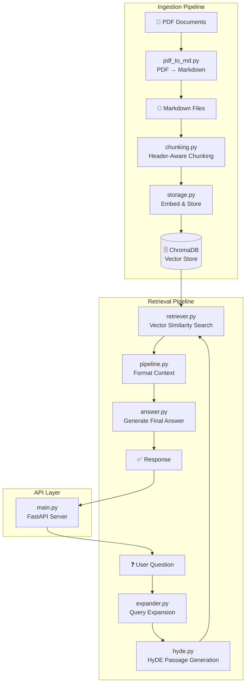
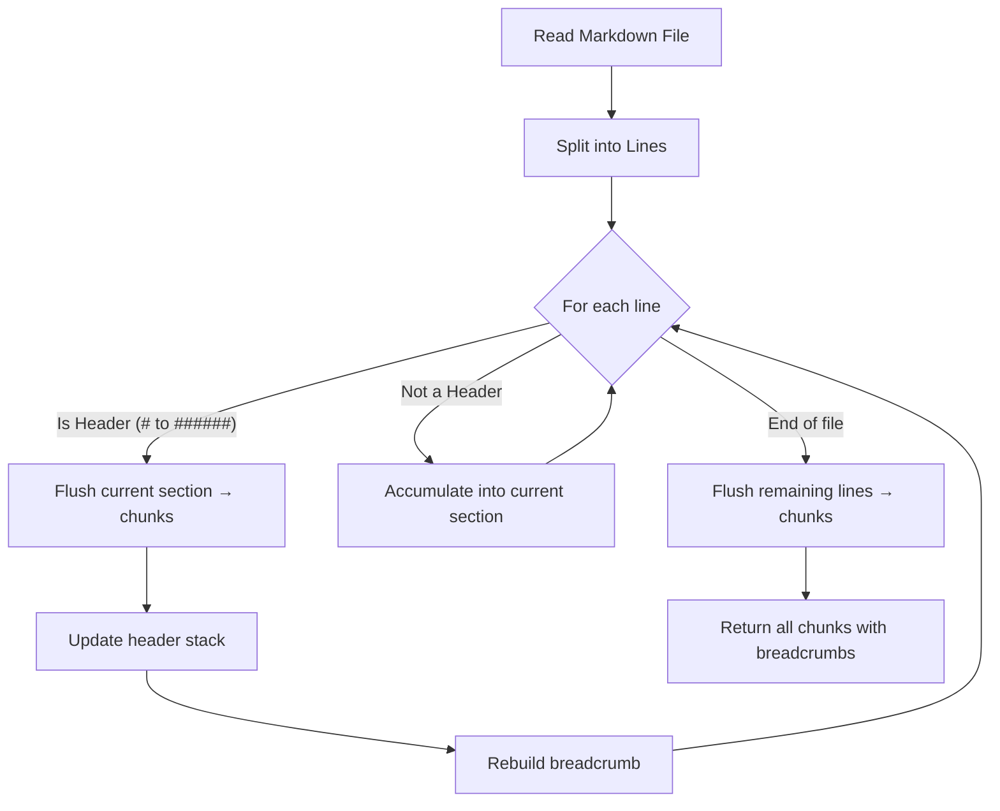
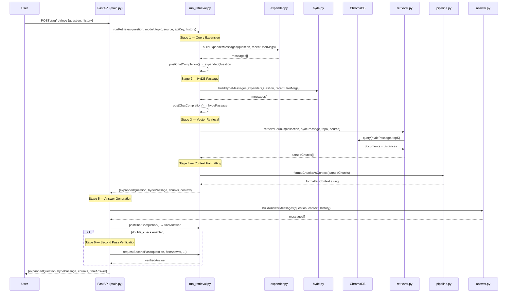
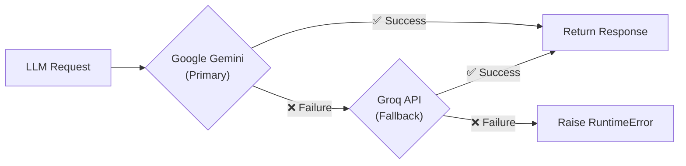

# CampusIQ — RAG Application Summary

> A Retrieval-Augmented Generation (RAG) system built for **FAST-NUCES** university, serving as an intelligent campus assistant that answers student questions using official university documents.

---

## High-Level Architecture



---

## 1. Ingestion Pipeline (`ingestion/`)

The ingestion pipeline converts raw PDF documents into searchable vector embeddings stored in ChromaDB. It runs **offline** before the API server starts.

### 1.1 PDF → Markdown Conversion — [pdf_to_md.py](https://github.com/soban23/campus-iq/blob/master/ingestion/pdf_to_md.py)

| Aspect | Detail |
|--------|--------|
| **Library** | `PyMuPDF (fitz)` for text extraction |
| **LLM** | `nvidia/nemotron-3-super-120b-a12b:free` via OpenRouter |
| **Purpose** | Converts raw PDF text into structured Markdown with headings, lists, tables, and semantic formatting |

**Flow:**
1. Opens the PDF with `fitz.open()` and extracts raw text page-by-page, annotating each page with `--- Page N ---` delimiters.
2. Sends the extracted text to the Nemotron model via OpenRouter's Chat Completions API with a detailed system prompt instructing it to preserve document structure (headings, lists, tables, links, footnotes).
3. Post-processes the response to strip any accidental triple-backtick wrapping.
4. Writes the clean Markdown to disk.

> [!IMPORTANT]
> This step uses an **LLM to intelligently structure** the raw text, not just dump it. The model is instructed to generate proper heading hierarchy (`#`, `##`, etc.), which is critical for the next chunking step.

---

### 1.2 Header-Aware Markdown Chunking — [chunking.py](https://github.com/soban23/campus-iq/blob/master/ingestion/chunking.py)

This is a **custom, non-library chunking implementation** that is section-aware rather than using naive fixed-size splitting.

**Constants:**
- `CHUNK_SIZE = 512` words per chunk
- `MAX_BREADCRUMB_LEN = 120` characters

**Algorithm:**



**Key Functions:**

| Function | Purpose |
|----------|---------|
| `getHeaderLevel(line)` | Detects Markdown headers (`#` through `######`), returns level 1–6 or 0 |
| `updateHeaderStack(stack, level, text)` | Maintains a stack of active headers; pops any header at the same or deeper level when a new header is encountered — this ensures correct nesting |
| `buildBreadcrumb(stack, filePath, maxLen)` | Builds a navigation path like `filename > Section > Subsection`, truncated to 120 chars |
| `splitIntoChunks(text, maxTokens)` | Splits section text into fixed-size word-based chunks of 512 words |
| `attachContext(chunks, breadcrumb)` | Prepends the breadcrumb path to each chunk as a context header |

**Example output chunk:**
```
handbook > Admission > Eligibility Criteria

Students applying for undergraduate programs must have at least 60% marks
in their intermediate examination...
```

> [!TIP]
> The breadcrumb prepended to each chunk is a clever approach — it ensures that during retrieval, the embedding captures **where** in the document the content came from, not just **what** the content says. This significantly improves retrieval relevance.

---

### 1.3 Vector Storage — [storage.py](https://github.com/soban23/campus-iq/blob/master/ingestion/storage.py)

| Aspect | Detail |
|--------|--------|
| **Vector DB** | ChromaDB (persistent, local file-based at `./chroma_db`) |
| **Collection** | `uni_documents_2025` |
| **Embedding Model** | `all-MiniLM-L6-v2` (SentenceTransformers, 384-dim) |
| **ID Format** | `{filename}-chunk-{index}` |

**Metadata stored per chunk:**

| Field | Example |
|-------|---------|
| `source` | `handbook.md` |
| `breadcrumb` | `handbook > Admission > Eligibility Criteria` |
| `chunk_index` | `7` |
| `section` | `Admission` (second part of breadcrumb) |

**Flow:**
1. Creates a persistent ChromaDB client.
2. Gets or creates the `uni_documents_2025` collection.
3. Generates unique IDs from the source filename + chunk index.
4. Extracts metadata (breadcrumb, section, source) from each chunk's header line.
5. Encodes all chunks into 384-dim vectors using MiniLM.
6. Inserts documents, embeddings, and metadata into ChromaDB in a single batch.

---

### 1.4 Ingestion Entry Point — [run_ingest.py](https://github.com/soban23/campus-iq/blob/master/ingestion/run_ingest.py)

A simple CLI script that ties the pipeline together:
```
chunkMarkdownFile(filePath) → storeChunksInChroma(chunks, filePath)
```

---

## 2. Retrieval Pipeline (`retrieval/` + `run_retrieval.py`)

The retrieval pipeline uses a **multi-stage approach** combining Query Expansion, HyDE, and vector similarity search.

### 2.1 End-to-End Retrieval Flow



---

### 2.2 Stage 1: Query Expansion — [expander.py](https://github.com/soban23/campus-iq/blob/master/retrieval/expander.py)

**Approach:** LLM-based query rewriting

The raw user question is expanded by an LLM to include:
- Related terms and synonyms
- Keywords likely to appear in university handbooks/policy documents
- Disambiguation using recent conversation context

**Example:**
```
Input:  "What's the fee?"
Output: "What is the tuition fee structure, semester fee, charges, payment 
         schedule, and fee policy for undergraduate and graduate programs 
         at FAST-NUCES?"
```

> [!NOTE]
> If conversation history is provided, recent user messages are included in the prompt as numbered context lines. This helps resolve ambiguous references like "it", "that program", etc.

---

### 2.3 Stage 2: HyDE (Hypothetical Document Embeddings) — [hyde.py](https://github.com/soban23/campus-iq/blob/master/retrieval/hyde.py)

**Approach:** [HyDE](https://arxiv.org/abs/2212.10496) — a state-of-the-art retrieval technique

Instead of embedding the user's question directly and searching for similar chunks, HyDE asks the LLM to **generate a hypothetical answer passage** as if it were extracted from a university handbook. This synthetic passage is then used as the search query.

**Why this works:**
- Questions and answers live in different semantic spaces. A question like "What is the fee?" is semantically distant from a handbook paragraph about fee structures.
- The HyDE passage is much closer in embedding space to the actual document chunks, dramatically improving retrieval recall.

**System prompt essence:** *"You are a FAST-NUCES university handbook. Write a 3 to 5 sentence formal policy passage that directly answers the question."*

**Example:**
```
Input:  "What are the eligibility criteria for MS admission?"
HyDE:   "Applicants for the MS program must hold a four-year bachelor's degree
         from an HEC-recognized institution with a minimum CGPA of 2.5. A valid
         GAT General score with at least 50% marks is mandatory. Applicants must
         also pass the departmental entry test and interview."
```

---

### 2.4 Stage 3: Vector Retrieval — [retriever.py](https://github.com/soban23/campus-iq/blob/master/retrieval/retriever.py)

| Aspect | Detail |
|--------|--------|
| **Search Query** | The HyDE passage (not the raw question) |
| **Top-K** | Configurable, default 5 |
| **Distance Metric** | ChromaDB default (L2), converted to similarity score: `score = 1 - distance` |
| **Source Filtering** | Optional metadata filter on `source` field to restrict search to a specific document |

**Flow:**
1. `buildSourceFilter()` — creates a ChromaDB `$eq` filter if a source file is specified.
2. `queryCollection()` — queries ChromaDB with the HyDE passage as `query_texts`, retrieving documents, metadatas, and distances.
3. `parseQueryResult()` — transforms the raw ChromaDB response into a clean list of `{text, metadata, score}` dicts.

> [!NOTE]
> ChromaDB handles embedding the query text internally using its default embedding function. The search is done against the pre-computed `all-MiniLM-L6-v2` embeddings stored during ingestion.

---

### 2.5 Stage 4: Context Formatting — [pipeline.py](https://github.com/soban23/campus-iq/blob/master/retrieval/pipeline.py)

Formats the retrieved chunks into a single context string for the LLM, with each chunk annotated:

```
--- Chunk 1 | handbook > Admission > Eligibility | Score: 0.847 ---
Students applying for undergraduate programs must have...

--- Chunk 2 | handbook > Fee Structure > Semester Fee | Score: 0.792 ---
The semester fee for the BS program is...
```

---

### 2.6 Stage 5: Answer Generation — [answer.py](https://github.com/soban23/campus-iq/blob/master/retrieval/answer.py)

**System prompt:** *"You are CampusIQ, a university assistant for FAST-NUCES. Answer the student question using only the provided context."*

**Message structure:**
1. System message (persona + rules)
2. System message (formatted context block)
3. Recent conversation history (up to 3 user-assistant pairs)
4. Current user question

**Guardrails:**
- Must answer from context only
- Must not mention chunk numbers or retrieval internals
- If information is missing: *"I don't have information on that. Please visit the respective university office."*

---

### 2.7 Stage 6: Double-Check / Second Pass — [requestSecondPass()](https://github.com/soban23/campus-iq/blob/master/run_retrieval.py#L261-L279)

An **optional verification step** (enabled via `double_check: true`). After the first answer is generated, a follow-up message is sent:

```
User:      [original question]
Assistant: [first answer]
User:      "Are you sure? Think carefully."
```

This prompts the model to self-verify, potentially catching hallucinations or errors in the first response.

---

## 3. API Layer — [main.py](https://github.com/soban23/campus-iq/blob/master/main.py)

| Aspect | Detail |
|--------|--------|
| **Framework** | FastAPI |
| **Endpoint** | `POST /rag/retrieve` |
| **CORS** | Configurable via `CORS_ORIGINS` env var, defaults to localhost dev ports |

### Request Schema (`RetrievalRequest`)

| Field | Type | Default | Description |
|-------|------|---------|-------------|
| `question` | `str` | required | The student's question |
| `source` | `str?` | `None` | Filter retrieval to a specific source document |
| `top_k` | `int` | `5` | Number of chunks to retrieve |
| `model` | `str` | `gemini-2.5-flash` | LLM model name |
| `max_tokens` | `int` | `500` | Max tokens for answer generation |
| `api_key` | `str` | from env | Google Generative AI API key |
| `double_check` | `bool` | `false` | Enable second-pass verification |
| `show_context` | `bool` | `false` | Include raw context in response |
| `history` | `list[dict]` | `[]` | Conversation history for multi-turn |

### Response Schema (`RetrievalResponse`)

| Field | Type | Description |
|-------|------|-------------|
| `expandedQuestion` | `str` | The LLM-rewritten expanded query |
| `hydePassage` | `str` | The generated hypothetical document |
| `chunks` | `list[dict]` | Retrieved chunks with text, metadata, scores |
| `finalAnswer` | `str` | The generated answer |
| `context` | `str?` | Formatted context (only if `show_context=true`) |

---

## 4. LLM Provider Strategy — [postChatCompletion()](https://github.com/soban23/campus-iq/blob/master/run_retrieval.py#L83-L157)

The system uses a **primary + fallback** LLM strategy:



| Provider | Model | SDK / Protocol |
|----------|-------|----------------|
| **Primary** | `gemini-2.5-flash` | `google-genai` Python SDK (synchronous, wrapped in `asyncio.to_thread`) |
| **Fallback** | `llama-3.3-70b-versatile` | Groq REST API via `httpx.AsyncClient` (OpenAI-compatible) |

> [!IMPORTANT]
> The Gemini SDK uses `generate_content()` (not chat completions), so the message list is flattened into a single prompt with `ROLE:\ncontent` formatting via `buildPromptFromMessages()`. The fallback Groq path uses the standard OpenAI chat completions format directly.

---

## 5. Key Approaches & Techniques Summary

| Technique | Where | Why |
|-----------|-------|-----|
| **LLM-Assisted PDF Conversion** | `pdf_to_md.py` | Produces structured Markdown with proper headings, enabling header-aware chunking |
| **Header-Aware Chunking** | `chunking.py` | Splits documents at section boundaries rather than arbitrary positions; preserves document structure |
| **Breadcrumb Context Injection** | `chunking.py` | Each chunk carries its section hierarchy, improving embedding quality and retrieval precision |
| **Query Expansion** | `expander.py` | Enriches short/ambiguous questions with synonyms and related terms before retrieval |
| **HyDE (Hypothetical Document Embeddings)** | `hyde.py` | Bridges the question-document semantic gap by searching with a synthetic answer passage |
| **Conversation-Aware Retrieval** | `expander.py`, `hyde.py`, `answer.py` | Uses recent chat history to disambiguate pronouns and references in follow-up questions |
| **Dual-Provider Fallback** | `run_retrieval.py` | Ensures availability by falling back from Gemini to Groq on failure |
| **Second-Pass Verification** | `run_retrieval.py` | Optional self-check where the LLM re-evaluates its own answer to reduce hallucinations |
| **Source Filtering** | `retriever.py` | Allows restricting retrieval to a specific document via metadata filters |
| **Sentence Transformers Embeddings** | `storage.py` | Uses lightweight `all-MiniLM-L6-v2` (384-dim) for fast, local embedding generation |

---

## 6. File Map

```
campusiq-app/
├── main.py                    # FastAPI server, /rag/retrieve endpoint
├── run_retrieval.py           # Orchestrator: ties all retrieval stages together
├── ingestion/
│   ├── __init__.py            # Exports: chunkMarkdownFile, storeChunksInChroma
│   ├── pdf_to_md.py           # PDF → Markdown via PyMuPDF + Nemotron LLM
│   ├── chunking.py            # Header-aware Markdown chunking with breadcrumbs
│   ├── storage.py             # ChromaDB storage with MiniLM embeddings
│   └── run_ingest.py          # CLI entry point for ingestion
├── retrieval/
│   ├── __init__.py            # Exports: all retrieval building blocks
│   ├── expander.py            # Query expansion prompt builder
│   ├── hyde.py                # HyDE passage prompt builder
│   ├── retriever.py           # ChromaDB vector search + result parsing
│   ├── pipeline.py            # Context formatting from retrieved chunks
│   └── answer.py              # Answer generation prompt builder + history handling
├── chroma_db/                 # Persistent ChromaDB storage directory
└── frontend/                  # Frontend application (separate)
```
